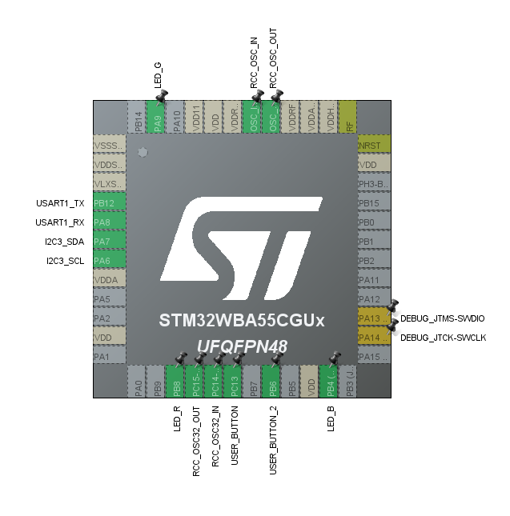
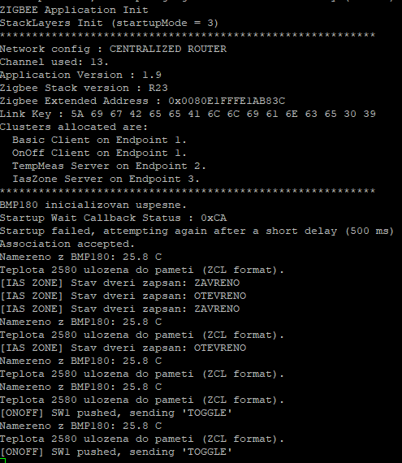

# Zigbee Router: Multi-Sensor Node (TestV1)

*Tento projekt byl vytvořen v rámci předmětu **MPC-SSY**.*

## 👥 Autor
* **Bc. Matěj Matoušek (247142)** – *Router*

Tato složka obsahuje firmware pro vývojovou desku **Nucleo-WBA55CG**. Zařízení v Zigbee síti funguje v roli **Routeru** a sdružuje tři logické funkce:
1. **Chytrý vypínač** (Toggle funkce - odesílání příkazů pro On/Off zařízení).
2. **Teplotní senzor** (Čtení reálné teploty z I2C senzoru BMP180).
3. **Senzor dveří/oken** (Kontakt simulovaný tlačítkem využívající IAS Zone cluster).

## 🛠️ Stručná konfigurace v STM32CubeMX


Pro správný běh Zigbee stacku a periférií je projekt v CubeMX nastaven následovně:

### 1. Základní periferie
* **TIM2:** Nastaven jako zdroj přerušení s periodou 2 sekundy. Slouží pro pravidelné vyčítání teploty ze senzoru bez blokování hlavní smyčky.
* **I2C3:** Slouží ke komunikaci se senzorem BMP180. Rychlost je ponechána na Standard Mode (100 kHz). Fyzická adresa senzoru je `0x77` (v kódu posunuta o 1 bit na `0xEE`).
* **USART1:** Použit pro výpis ladících informací (Log) rychlostí 115200 bd.
    * **Kritické nastavení (DMA):** Aby logování přes UART nenarušovalo přesné časování rádiového stacku, je nutné v záložce *DMA Settings* u USART1 přidat **USART1_TX kanál (GPDMA1)**. Bez tohoto nastavení by systém při pokusu o první logový výpis spadl do `HardFault`. Zároveň je nutné mít zapnuté příslušné globální přerušení v NVIC.

### 2. Middleware: STM32_WPAN (Zigbee)
Konfigurace rádiového stacku se nachází v sekci *Middleware and Software Packs* -> *STM32_WPAN*:
* Role nastavena na **Router**.
* **Endpoint Vypínač:** Obsahuje `OnOff Client` cluster. Deska zařízení sama nestavuje, pouze posílá `Toggle` příkazy na adresu `0x0000` (Coordinator).
* **Endpoint Teplota:** Obsahuje `Temperature Measurement Server` cluster. Zde lokálně zapisujeme naměřenou hodnotu ve formátu ZCL (stupně Celsia * 100).
* **Endpoint Dveřní kontakt:** Obsahuje `IAS Zone Server` cluster. Zde logujeme stavy Alarm (otevřeno) a Clear (zavřeno).

### 3. Zpráva paměti (Linker a Heap)
Rádiový stack WBA55 alokuje buffery dynamicky (`malloc`). Vzhledem k použitým endpointům bylo nutné razantně navýšit paměť, jinak by aplikace havarovala s nedostatkem paměti (`zb_msg_tick` error).
* V Linker skriptu (`STM32WBA55CGUX_FLASH.ld`) byla paměť sjednocena do jednoho 128KB bloku `RAM`.
* **Minimum Heap Size** byl navýšen na `0x10000` (64 KB).
* **Minimum Stack Size** byl navýšen na `0x1000` (4 KB).

## 🛠️ Detailní nastavení periférií v STM32CubeMX

### TIM2 (Časovač pro periodické měření)
Časovač TIM2 slouží k pravidelnému spouštění měření teploty. Abychom neblokovali kritické časování Zigbee stacku uvnitř hlavní smyčky pomocí `HAL_Delay()`, využíváme přerušení od časovače. To v našem kódu pouze zvedne "vlajku" (flag), kterou následně bezpečně zpracuje hlavní smyčka `while(1)`.

**Konfigurace v záložce Parameter Settings:**
* **Clock Source:** Internal Clock
* **Prescaler (PSC):** `31999` (Dělí frekvenci systémových hodin, počítáme od nuly, takže dělitel je 32 000).
* **Counter Mode:** Up
* **Counter Period (ARR):** `499` (Určuje, do kolika časovač počítá, než vyvolá událost. Spolu s nastaveným taktem procesoru toto nastavení generuje přesnou periodu pro vyčítání).
* Ostatní parametry (Dithering, auto-reload preload) jsou ponechány na `Disable`.

**Konfigurace v záložce NVIC Settings:**
* **TIM2 global interrupt:** `Enabled` (Zaškrtnuto). Toto je nezbytné, aby časovač po dosažení hodnoty 499 skutečně zavolal přerušení v kódu.

### I2C3 (Komunikace se senzorem BMP180)
Sběrnice I2C je využívána pro čtení kalibračních dat a naměřené teploty ze senzoru BMP180. Vzhledem k požadavkům senzoru je nastavena na standardní, velmi spolehlivou rychlost.

**Konfigurace v záložce Parameter Settings:**
* **I2C Speed Mode:** Standard Mode
* **I2C Speed Frequency (KHz):** `100`
* **Analog Filter:** Enabled
* **Primary Address Length selection:** 7-bit
* Ostatní parametry jako *Clock No Stretch Mode* nebo *Autonomous Mode* jsou ponechány na výchozích hodnotách (`Disabled`).

**Konfigurace v záložce GPIO Settings:**
* Sběrnice je namapována na piny **PA6 (I2C3_SCL)** a **PA7 (I2C3_SDA)**.
* **GPIO Pull-up/Pull-down:** `No pull-up and no pull-down` 
*(Důležitá poznámka k hardwaru: I2C sběrnice vyžaduje hardwarové pull-up rezistory k napájení 3.3V. Většina breakout modulů BMP180, stjně tak jako náš, je má již fyzicky osazené na desce plošných spojů. Pokud používáte holý čip, je nutné přidat externí odpory, např. 4.7 kΩ).*

### GPIO (LED indikace a uživatelská tlačítka)
Tyto piny slouží pro základní vizuální signalizaci stavu sítě a pro uživatelskou interakci (odesílání příkazů a simulace senzoru dveří).

**Konfigurace LED diod (Výstupy):**
* Namapovány na piny **PA9 (LED_G)**, **PB4 (LED_B)** a **PB8 (LED_R)**.
* **GPIO mode:** Output Push Pull
* **GPIO output level:** High (výchozí stav, na Nucleo deskách typicky znamená, že LED je zhasnutá).
* **GPIO Pull-up/Pull-down:** No pull-up and no pull-down

**Konfigurace tlačítek (Vstupy s přerušením):**
Tlačítka slouží k manuálnímu odesílání `Toggle` příkazu pro Endpoint 1 a k simulaci magnetického senzoru pro Endpoint 3. Abychom zachytili stisk okamžitě a nemuseli stav pinů neustále vyčítat v hlavní smyčce, využíváme hardwarové přerušení (EXTI).
* Namapovány na piny **PB6 (USER_BUTTON)** a **PC13 (USER_BUTTON)**.
* **GPIO mode:** External Interrupt Mode (spouští přerušení při změně stavu pinu).
* **GPIO Pull-up/Pull-down:** Pull-up (Zajišťuje definovanou logickou "1", pokud tlačítko není fyzicky stisknuto).

**Konfigurace v záložce NVIC Settings:**
* Pro správné zachycení stisku tlačítek je nutné v systému povolit jejich hardwarová přerušení:
* **EXTI Line6 interrupt:** `Enabled` (Zaškrtnuto, obsluhuje pin PB6).
* **EXTI Line13 interrupt:** `Enabled` (Zaškrtnuto, obsluhuje pin PC13).

### STM32_WPAN (Konfigurace Zigbee Stacku)
Záložka STM32_WPAN obsahuje samotné srdce naší aplikace – definici Zigbee sítě a jednotlivých logických uzlů (Endpointů). Zaměřili jsme se na tyto specifické změny:

**Záložka ZIGBEE Applications and Services:**
* **Zigbee Device Role:** `Router` (Zařízení trvale napájené, pomáhá routovat zprávy ostatním zařízením v síti).
* **Zigbee Application:** `Full Function Device`
* **Number of End Points:** `3` (Definuje počet našich logických senzorů/zařízení).
* **Channel:** `13` (Napevno zvolený kanál pro snazší ladění a párování).

**Záložka Configuration (Paměť a Logování):**
* V sekci *Application configuration - Logs* je `CFG_LOG_SUPPORTED` nastaveno na `Enabled` a transportní vrstva na `UART`. Tyto logy nám pomáhají sledovat dění uvnitř stacku.
* V sekci *Application configuration - Memory manager* je zvoleno `No Memory manager (malloc/free)`. Z tohoto důvodu bylo nutné provést rozsáhlé změny v Linker skriptu a sjednotit paměť RAM, aby měl `malloc` dostatek místa pro alokaci tří endpointů.

**Záložka Platform Settings:**
* **Serial Link for Logs:** Zvolen `USART1`. Tímto jsme WPAN stacku řekli, kam má fyzicky posílat textové ladící výpisy.

**Záložka ENDPOINT 1 (Chytrý vypínač):**
Tento endpoint slouží k manuálnímu odesílání příkazu Toggle.
* **Profile ID:** `Home Automation (HA)`
* **Device ID:** `OnOff switch`
* **Clusters:**
  * `Basic:` Server/Client
  * `On/Off:` **Client** (Protože my jsme ovladač a příkazy odesíláme/generujeme, nevlastníme reálné relé).

**Záložka ENDPOINT 2 (Teplotní senzor):**
Slouží k publikování naměřených dat z I2C sběrnice.
* **Profile ID:** `Home Automation (HA)`
* **Device ID:** `Temperature sensor`
* **Clusters:**
  * `Basic:` Server
  * `Temperature Measurement:` **Server** (My vlastníme naměřená data).
  * Konfigurace teploty: Minimální hodnota `-27315` (-273.15 °C), maximální `32767` (327.67 °C), tolerance `2048`.

**Záložka ENDPOINT 3 (Dveřní senzor / Magnetický kontakt):**
Využívá zabezpečovací IAS Zone cluster pro odesílání stavu otevřeno/zavřeno.
* **Profile ID:** `Home Automation (HA)`
* **Device ID:** `IAS zone`
* **Clusters:**
  * `Basic:` Server
  * `IAS Zone:` **Server**. Má zaškrtnutý parametr `callback server mode_change`, který do kódu vygeneruje záchytnou funkci pro obsluhu testovacího režimu alarmu.
 
### USART1 a GPDMA1 (Ladící výpisy - Logování)
Sériová linka USART1 (115200 bd) je využívána pro výpis ladících informací (Logů) z aplikace a ze samotného Zigbee stacku. 

**Kritická závislost na DMA:**
Rádiový stack `STM32_WPAN` v této architektuře vnitřně počítá s tím, že logování přes UART probíhá asynchronně pomocí DMA (Direct Memory Access). Pokud by se k odesílání logů použil standardní blokovací režim, procesor by se zdržel čekáním na odeslání znaků, zmeškal by kritické rádiové události a systém by okamžitě spadl do stavu `HardFault`. 

Proto je nezbytné nastavit **GPDMA1** následovně:

**Konfigurace GPDMA1 (Záložky All Channels a CH0 / CH1):**
* **Channel 0:** `Standard Request Mode`
  * **Request:** `USART1_TX`
  * **Direction:** `Memory To Peripheral` (Přenos dat z RAM paměti ven na UART)
  * **Priority:** `Low`
  * **Source Address Increment:** `Enabled` (Aby DMA postupně četlo celý textový řetězec)
* **Channel 1:** `Standard Request Mode`
  * **Request:** `USART1_RX`
  * **Direction:** `Peripheral To Memory`
  * **Priority:** `Low`
  * **Source Address Increment:** `Disabled`




## 💻 Softwarové řešení

Většina aplikační logiky pro Zigbee komunikaci se nachází v souborech vygenerovaných v adresáři `STM32_WPAN/App` a v hlavní smyčce v `main.c`. Níže jsou popsány klíčové funkce a úpravy, které tvoří logiku našeho routeru.

### 1. Zigbee Endpointy (`app_zigbee_endpoint.c`)

#### Identifikace senzoru dveří (IAS Zone Type)
Ačkoliv CubeMX vygeneroval Endpoint 3 s IAS Zone clusterem, výchozí typ zóny by domácí brány nedokázaly správně rozpoznat (zobrazovalo by se neznámé zařízení). Bylo nutné upravit inicializační funkci `APP_ZIGBEE_ConfigEndpoints`, aby se senzor síti explicitně nahlásil jako dveřní/okenní kontakt.
```c
/* USER CODE BEGIN APP_ZIGBEE_ConfigEndpoints2 */
// Změna ZoneType na Dveřní / Okenní senzor
ZbZclAttrIntegerWrite(stZigbeeAppInfo.IasZoneServer_3,
        ZCL_IAS_ZONE_SVR_ATTR_ZONE_TYPE,
        ZCL_IAS_ZONE_SVR_ZONE_TYPE_DOOR_WINDOW);
/* USER CODE END APP_ZIGBEE_ConfigEndpoints2 */
```

#### Odesílání stavu dveří (Automatické notifikace)
Funkce `APP_ZIGBEE_UpdateDoorState()` obsluhuje logiku otevření/zavření. Využívá atribut `ZoneStatus`, u kterého vyčteme aktuální stav a pouze maskujeme nultý bit (Alarm 1). 

Oproti jiným Zigbee stackům není v ST WPAN nutné manuálně generovat a odesílat ZCL příkaz `Zone Status Change Notification`. Stack v STM32 využívá interní callback. Jakmile dojde k přepisu atributu pomocí `ZbZclAttrIntegerWrite`, stack změnu detekuje a notifikaci do sítě rozešle zcela automaticky na pozadí.

```c
void APP_ZIGBEE_UpdateDoorState(bool is_open) {
	uint16_t current_status = 0;
	enum ZclStatusCodeT attr_status;

	// 1. Přečtení aktuálního stavu (abychom přepsali jen Alarm bit)
	current_status = (uint16_t)ZbZclAttrIntegerRead(
	        stZigbeeAppInfo.IasZoneServer_3,
	        ZCL_IAS_ZONE_SVR_ATTR_ZONE_STATUS,
	        NULL,
	        &attr_status);

	// 2. Úprava nultého bitu (Alarm 1)
	if (is_open) {
		current_status |= 0x0001;  // Nastavení bitu (otevřeno)
	} else {
		current_status &= ~0x0001; // Vymazání bitu (zavřeno)
	}

	// 3. Zápis nového stavu zpět do paměti
	enum ZclStatusCodeT write_status = ZbZclAttrIntegerWrite(
	        stZigbeeAppInfo.IasZoneServer_3,
	        ZCL_IAS_ZONE_SVR_ATTR_ZONE_STATUS,
	        current_status);

	if (write_status == ZCL_STATUS_SUCCESS) {
		LOG_INFO_APP("[IAS ZONE] Stav dveri zapsan: %s",
				is_open ? "OTEVRENO" : "ZAVRENO");
	} else {
		LOG_ERROR_APP("Chyba zapisu IAS Zone atributu: 0x%02X", write_status);
	}
}
```

#### Aktualizace teploty
Funkce `APP_ZIGBEE_UpdateTemperature()` je volána po úspěšném vyčtení dat z I2C. Zajišťuje konverzi reálné teploty ve formátu `float` (např. 25.43 °C) na Zigbee ZCL formát (celé číslo vynásobené 100, tj. 2543) a následný zápis do clusteru `Temperature Measurement`.

```c
void APP_ZIGBEE_UpdateTemperature(float temperature_celsius)
{
    int16_t zigbee_temp = (int16_t)(temperature_celsius * 100.0f);

    enum ZclStatusCodeT status = ZbZclAttrIntegerWrite(
        stZigbeeAppInfo.TempMeasServer_2, // Náš Teplotní Server
        ZCL_TEMP_MEAS_ATTR_MEAS_VAL,
        zigbee_temp
    );

    if (status == ZCL_STATUS_SUCCESS) {
        LOG_INFO_APP("Teplota %d ulozena do pameti (ZCL format).", zigbee_temp);
    } else {
        LOG_ERROR_APP("Chyba zapisu teploty: 0x%02X", status);
    }
}
```

#### Odeslání Toggle příkazu
Stisk hlavního tlačítka (namapovaného na `BSP` vrstvu) vyvolá funkci `APP_BSP_Button1Action()`. Tato funkce nejprve ověří, zda je zařízení úspěšně připojeno do Zigbee sítě. Pokud ano, sestaví adresní strukturu pro Koordinátora (krátká adresa `0x0000`) a odešle standardní ZCL příkaz `Toggle` na Endpoint 1. Tímto způsobem router vzdáleně ovládá stav (On/Off) na cílovém zařízení.

```c
void APP_BSP_Button1Action(void)
{
  struct ZbApsAddrT     stDest;
  enum ZclStatusCodeT   eStatus;

  // Ověření, zda je aplikace již připojena do sítě
  if ( APP_ZIGBEE_IsAppliJoinNetwork() != false )
  {
    // Příprava cílové adresy (0x0000 = Koordinátor)
    memset( &stDest, 0, sizeof( stDest) );
    stDest.endpoint = APP_ZIGBEE_ENDPOINT_1;
    stDest.mode = ZB_APSDE_ADDRMODE_SHORT;
    stDest.nwkAddr = 0;

    LOG_INFO_APP( "\r[ONOFF] SW1 pushed, sending 'TOGGLE'" );
    
    // Odeslání požadavku Toggle přes OnOff Client cluster
    eStatus = ZbZclOnOffClientToggleReq( stZigbeeAppInfo.OnOffClient_1, &stDest, NULL, NULL );
    
    if ( eStatus != ZCL_STATUS_SUCCESS )
    {
      LOG_ERROR_APP( "[ONOFF] Error, OnOff Client Request failed (0x%02X).", eStatus );
    }
  }
}
```

