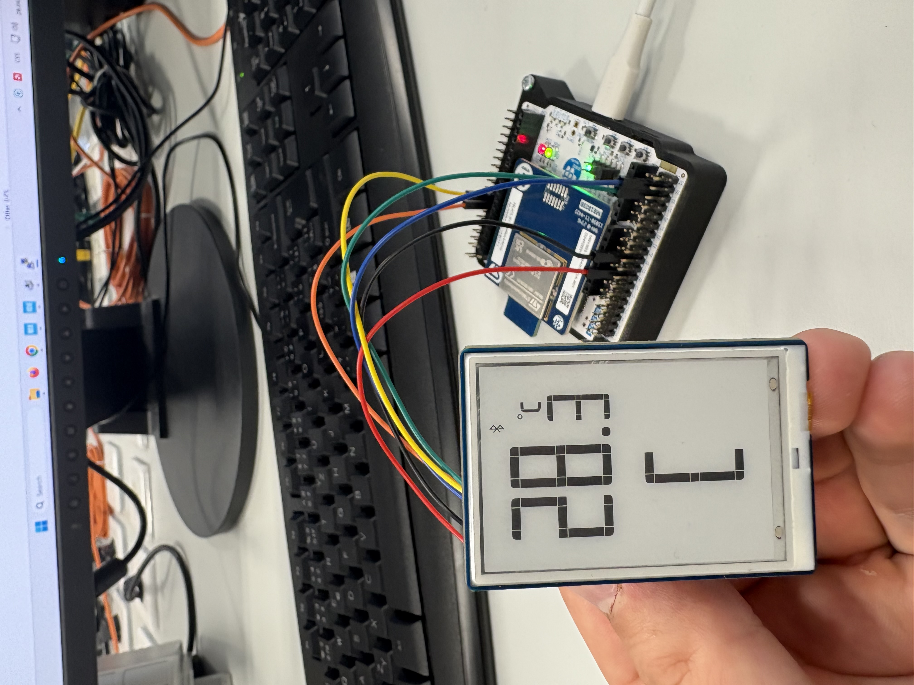

# 🧠 Zigbee Koordinátor a Zobrazovací jednotka

*Tento projekt byl vytvořen v rámci předmětu **MPC-SSY**.*

## 👥 Autor
* **Bc. Oldřich Hána (247113)** – *Koordinátor*

---

## 📌 Hardwarové zapojení (Pinout)
Základem koordinátoru je vývojová deska **Nucleo-WBA55CG**. 
* **I2C1:** Sběrnice pro ovládání E-Paper displeje.
* **USART1:** Ladící rozhraní (115200 baud).
* **PC13 (B1):** Tlačítko pro spuštění funkce `Permit Join` (povolení párování na 60s).
* **PB11 (LED):** Modrá LED dioda ovládaná vzdáleně z routeru.

*(snímek z CubeMX)*


---

## 🛠️ Softwarové řešení 

### 1. Vlastní printf logování (Ušetřené 3 týdny času)
Jedním z klíčových rozhodnutí v projektu bylo opuštění nativního, velmi komplexního systému *ST Advanced Trace*. Místo něj jsme implementovali vlastní nízkoúrovňový redirect `__io_putchar` přímo na UART.

```c
int __io_putchar(int ch) {
  HAL_UART_Transmit(&huart1, (uint8_t *)&ch, 1, 0xFFFF);
  return ch;
}
```

**Proč?** Ačkoliv toto řešení obchází doporučené postupy výrobce, ušetřilo nám zhruba **3 týdny reverzního inženýrství** a ladění konfiguračních souborů trace frameworku. Díky tomu jsme mohli okamžitě vidět čisté logy ze stacku a vytvořit přehledný **Cluster Dashboard** v Putty.

*(screenshot z Putty)*


### 2. Hlavní smyčka a zpracování událostí
Aplikace využívá událostmi řízenou architekturu (Callbacks). Hlavní smyčka je maximálně odlehčená – procesor většinu času spí nebo obsluhuje stack, a pouze na základě asynchronní vlajky `ma_se_prekreslit` z callbacků překresluje displej.

```c
// main.c
while (1) {
  if (ma_se_prekreslit) {
    EPD_Custom_Update(); // Bliknutí/smazání displeje
    
    if (kolega_adresa == 0xFFFF) {
      EPD_Zobraz_Aplikaci(0, 0, false); // Vypíše nuly, pokud nikdo není připojen
    } else {
      EPD_Zobraz_Aplikaci(nova_teplota, stav_dveri, true); // Vykreslí reálná data
    }
    
    ma_se_prekreslit = 0;
  }
  MX_APPE_Process(); // Zpracování Zigbee stacku
}
```

### 3. E-Paper UI 
Displej (1.9" EPD) nevyužívá žádný grafický engine. Pracujeme přímo s buffery segmentů (`epd_custom.c`).
* **Teplota:** Hodnoty přijaté ze sítě jako `int16` jsou matematicky rozloženy na číslice a rovnou mapovány na segmenty.
* **Symbol Dveří:** Protože displej nemá dedikovanou ikonu pro dveře, použili jsme grafický trik se segmenty číslice `0` na indexu 7 a 8. Vypnutím pravé strany segmentu (`epd_buffer[8] = 0x00`) jsme vytvořili symbol otevřeného křídla `[`, což efektivně indikuje stav senzoru.

```c
// epd_custom.c
if (stav_dveri == 0) {
    // ZAVŘENO: Symbol [ ] (využívá segmenty číslice 0)
    epd_buffer[7] = 0xBF;
    epd_buffer[8] = 0x1F;
} else {
    // OTEVŘENO: Symbol [ (pravá strana "dveří" se vypne)
    epd_buffer[7] = 0xBF;
    epd_buffer[8] = 0x00;
}
```

*(fotka displeje)*



### 4. Příjem teploty a Toggle příkazu (Zigbee Endpoints)
Koordinátor hostuje na **Endpointu 1** clustery `Temperature Measurement (Client)` a `OnOff (Server)`. Po připojení senzoru automaticky volá `APP_ZIGBEE_ConfigReporting`, čímž senzoru "vnutí" pravidla, jak často má posílat teplotu. Následně data přicházejí asynchronně.

**Teplota (Zpracování reportu):**
```c
// app_zigbee_endpoint.c
static void APP_ZIGBEE_TempMeasServerReport(...) {
  if (iAttributeId == ZCL_TEMP_MEAS_ATTR_MEAS_VAL) {
    int16_t iAttrValue = (int16_t)pletoh16(pDataInputPayload);
    nova_teplota = (int16_t)(iAttrValue / 10); // Přepočet na desetiny (např. 254)
    ma_se_prekreslit = 1;
  }
}
```

**Vzdálené ovládání LED (Toggle):**
```c
// app_zigbee_endpoint.c
static enum ZclStatusCodeT APP_ZIGBEE_OnOffServerToggleCallback(...) {
  HAL_GPIO_TogglePin(GPIOB, LED_BLUE_Pin); // Fyzické přepnutí LED na desce
  printf("\r\n[ZIGBEE] PRIJAT PRIKAZ: TOGGLE\r\n");
  return ZCL_STATUS_SUCCESS;
}
```

### 5. IAS Zone Enrollment 
Tato deska funguje jako **CIE (Control Indicator Equipment)**. Proces navázání zabezpečeného spojení s "magnetem" (tlačítkem) probíhá takto:
1. Jakmile se v síti objeví nové zařízení, spustí se `APP_ZIGBEE_SetNewDevice`.
2. Koordinátor zjistí svou IEEE adresu přes `ZbExtendedAddress` a zapíše ji do routeru na **Endpoint 3**.
3. Router (Senzor) odpoví pomocí `Zone Enroll Request`.
4. Koordinátor v callbacku požadavek schválí (`ZCL_IAS_ZONE_CLI_RESP_SUCCESS`).
5. Od této chvíle jakýkoliv stisk tlačítka na routeru vyvolá `ZoneStatusChangeCallback`.

**Zápis CIE adresy:**
```c
// app_zigbee_endpoint.c
uint64_t mojeIeee = ZbExtendedAddress(stZigbeeAppInfo.pstZigbee);

writeReq.attr[0].attrId = ZCL_IAS_ZONE_SVR_ATTR_CIE_ADDR;
writeReq.attr[0].value = (uint8_t *)&mojeIeee;

ZbZclWriteReq(stZigbeeAppInfo.IasZoneClient, &writeReq, My_IAS_Write_CB, NULL);
```

**Schválení Enroll Requestu:**
```c
// app_zigbee_endpoint.c
static enum ZclStatusCodeT APP_ZIGBEE_IasZoneClientZoneEnrollReqCallback(...) {
  printf("\r\n[ZIGBEE] IAS Zone Enroll Request od 0x%llx. Schvaluji...\r\n", lExtendedSrcAddress);
  
  *pstRspCode = ZCL_IAS_ZONE_CLI_RESP_SUCCESS; // Potvrzení senzoru (OK!)
  *pcZoneId = 0x01; // Přiřazení ID v naší zóně
  
  return ZCL_STATUS_SUCCESS;
}
```
