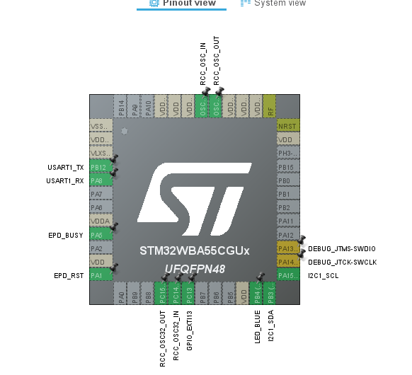
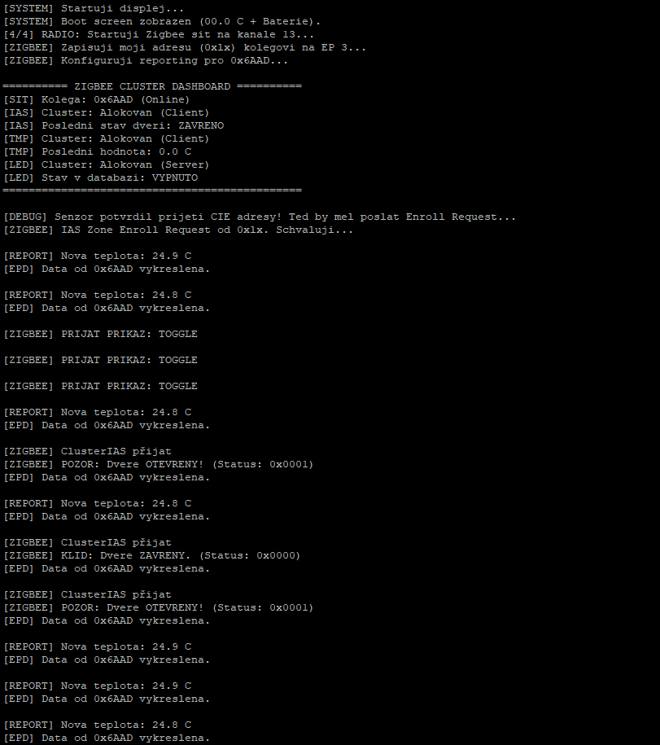

# Zigbee Koordinátor a Zobrazovací jednotka

*Tento projekt byl vytvořen v rámci předmětu **MPC-SSY**.*

## 👥 Autor
* **Bc. Oldřich Hána (247113)** – *Koordinátor*


## 📌 Hardwarové zapojení (Pinout)
Základem koordinátoru je vývojová deska **Nucleo-WBA55CG**. 
* **I2C1:** Sběrnice pro ovládání E-Paper displeje.
* **USART1:** Ladící rozhraní (115200 baud).
* **PC13 (B1):** Tlačítko pro spuštění funkce `Permit Join` (povolení párování na 60s).
* **PB11 (LED):** Modrá LED dioda ovládaná vzdáleně z routeru.

*( snímek z CubeMX)*



---

## 🛠️ Softwarové řešení a "Engineering Hacks"

### 1. Vlastní printf logování (Ušetřené 3 týdny času)
Jedním z klíčových rozhodnutí v projektu bylo opuštění nativního, velmi komplexního systému *ST Advanced Trace*. Místo něj jsme implementovali vlastní nízkoúrovňový redirect `__io_putchar` přímo na UART.

```c
int __io_putchar(int ch) {
  HAL_UART_Transmit(&huart1, (uint8_t *)&ch, 1, 0xFFFF);
  return ch;
}
```

**Proč?** Ačkoliv toto řešení obchází doporučené postupy výrobce, ušetřilo nám zhruba **3 týdny reverzního inženýrství** a ladění konfiguračních souborů trace frameworku. Díky tomu jsme mohli okamžitě vidět čisté logy ze stacku a vytvořit přehledný **Cluster Dashboard** v Putty.

*screenshot z Putty*



### 2. E-Paper UI a Grafický "Trick"
Displej (1.9" EPD) nevyužívá žádný grafický engine. Pracujeme přímo s buffery segmentů (`epd_custom.c`).
* **Teplota:** Hodnoty přijaté ze sítě jako `int16` jsou matematicky rozloženy na číslice a mapovány na segmenty.
* **Symbol Dveří:** Protože displej nemá ikonu pro dveře, použili jsme segmenty číslice `0` na indexu 7 a 8. Vypnutím pravé strany segmentu (`epd_buffer[8] = 0x00`) jsme vytvořili symbol otevřeného křídla `[`, což efektivně indikuje stav senzoru.

*(fotku displeje)*


### 3. Zigbee Endpoints a Reporting
Koordinátor hostuje na **Endpointu 1** clustery:
* **Temperature Measurement (Client):** Po připojení senzoru automaticky volá `APP_ZIGBEE_ConfigReporting`. Tím senzoru "vnutí" pravidla, jak často má posílat teplotu (min 5s, max 30s).
* **OnOff (Server):** Přijímá příkazy `Toggle` z routeru. V callbacku `APP_ZIGBEE_OnOffServerToggleCallback` pak fyzicky měníme stav pinu `PB11`.

### 4. IAS Zone Enrollment (Bezpečnostní vazba)
Tato deska funguje jako **CIE (Control Indicator Equipment)**. Proces navázání spojení s ,,magnetem" probíhá takto:
1. Jakmile se v síti objeví nové zařízení, spustí se `APP_ZIGBEE_SetNewDevice`.
2. Koordinátor zjistí svou IEEE adresu přes `ZbExtendedAddress` a zapíše ji do routeru na **Endpoint 3**.
3. Router (Senzor) odpoví pomocí `Zone Enroll Request`.
4. Koordinátor v callbacku požadavek schválí (`ZCL_IAS_ZONE_CLI_RESP_SUCCESS`).
5. Od této chvíle jakýkoliv stisk tlačítka na routeru (simulace dveří) vyvolá `ZoneStatusChangeCallback`, který okamžitě aktualizuje E-Paper displej.
